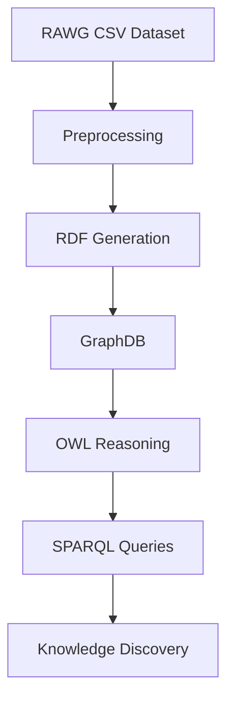
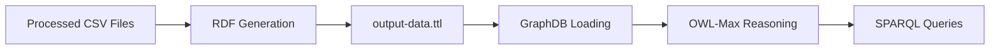

# 🎮 Video Game Knowledge Graph

<p align="center">
  
  
  
  
</p>

<p align="center">
  <b>Transforming RAWG video game data into a semantic knowledge graph using RDF, OWL reasoning, GraphDB, and SPARQL.</b>
</p>

---

## 🚀 Overview

This project implements a complete Semantic Web pipeline that transforms RAWG video game datasets into RDF triples, loads them into GraphDB, applies OWL reasoning, and enables advanced SPARQL querying.

### Pipeline



### Features

- 🎮 Video game knowledge graph generation
- 🔗 CSV → RDF transformation
- 🧠 OWL ontology reasoning
- 🌍 Wikidata entity linking
- 🔍 SPARQL querying
- 📊 Semantic inference and knowledge discovery

---

## 🛠️ Prerequisites

| Tool | Version |
|------|---------|
| Java | 11+ |
| Maven | 3.6+ |
| Python | 3.8+ |
| GraphDB | Any recent version |

---

## 📂 Dataset

The CSV files are not included in this repository due to size constraints and are provided separately in the project submission ZIP.

### Raw Data

```text
Dataset/raw_data/
├── games.csv
├── genres.csv
├── platforms.csv
├── parent_platforms.csv
├── developers.csv
├── publishers.csv
├── creators.csv
├── stores.csv
├── tags.csv
└── creator-roles.csv
```

### Processed Data

Generated by `preprocess.py`.

```text
Dataset/processed/
├── games_flat.csv
├── game_genres.csv
├── game_platforms.csv
├── game_parent_platforms.csv
├── game_stores.csv
├── game_tags.csv
├── game_ratings.csv
├── game_esrb.csv
├── genres_flat.csv
├── platforms_flat.csv
├── parent_platforms_flat.csv
├── stores_flat.csv
├── tags_flat.csv
├── creator_roles_flat.csv
├── developers_flat.csv
├── publishers_flat.csv
├── creators_flat.csv
├── developer_games.csv
├── publisher_games.csv
├── creator_games.csv
├── creator_positions.csv
└── platform_parent_platform.csv
```

---

## ⚙️ Setup

### 1. Configure GraphDB

1. Install GraphDB.
2. Open `http://localhost:7200`.
3. Create a repository:

| Setting | Value |
|----------|--------|
| Name | `MiniProject` |
| Ruleset | `OWL-Max` |

> OWL-Max is required for inference-based queries.

### 2. Python Dependencies

Only standard library modules are used:

```python
csv
ast
os
```

### 3. Build the Project

```bash
cd MiniProject
mvn package
```

---

## ▶️ Running the Pipeline

### Step 1 — Preprocess Data

```bash
python src/preprocess.py
```

### Step 2 — Generate Wikidata Links (Optional)

```bash
python src/link_to_wikidata.py
```

Outputs:

- `sameAs_wikidata.ttl`
- `wikidata_cache.json`

### Step 3 — Execute the Pipeline

```bash
cd MiniProject
java -jar target/MiniProject-1.0-SNAPSHOT.jar
```

### Execution Flow



---

## 📁 Project Structure

```text
Ontology Project/
├── Dataset/
│   ├── raw_data/
│   └── processed/
├── MiniProject/
│   ├── pom.xml
│   └── src/main/
│       ├── java/ontology/
│       │   ├── Main.java
│       │   ├── RMLProcessor.java
│       │   ├── GraphDBConnector.java
│       │   └── SPARQLRunner.java
│       └── resources/queries/
├── src/
│   ├── preprocess.py
│   └── link_to_wikidata.py
├── videogame-ontology.ttl
├── mapping.rml.ttl
├── output-data.ttl
└── sameAs_wikidata.ttl
```

---

## 🔍 SPARQL Queries

| Query | Description |
|---------|-------------|
| Q1 | Console game inference |
| Q2 | Indie game inference |
| Q3 | Game–Developer–Publisher joins |
| Q4 | Steam and Metacritic filtering |
| Q5 | Creator role traversal |
| Q6 | Inverse property reasoning |
| Q7 | Genre aggregation |

### Reasoning-Dependent Queries

The following require OWL-Max reasoning:

- Q1
- Q2
- Q6

Without reasoning enabled, these queries return no results.

---

## 🧠 Technologies

| Category | Technology |
|-----------|------------|
| Semantic Web | RDF |
| Ontology | OWL 2 |
| Query Language | SPARQL |
| Triple Store | GraphDB |
| Mapping | RML |
| Programming | Java |
| Preprocessing | Python |
| Entity Linking | Wikidata |

---

## 📝 Notes

- Default game limit: **5000**
- Configurable via `GAME_LIMIT` in `Main.java`
- GraphDB must be running before execution
- Generated files should not be committed:
  - `output-data.ttl`
  - `sameAs_wikidata.ttl`

---

## 🎓 Learning Outcomes

This project demonstrates:

- Knowledge graph construction
- RDF modeling
- OWL reasoning
- SPARQL querying
- Entity linking with Wikidata
- Semantic Web technologies
- Data integration pipelines

---

## ⭐ Project Goal

Build a rich semantic representation of video game data that supports reasoning, inference, and advanced knowledge discovery beyond traditional relational queries.
